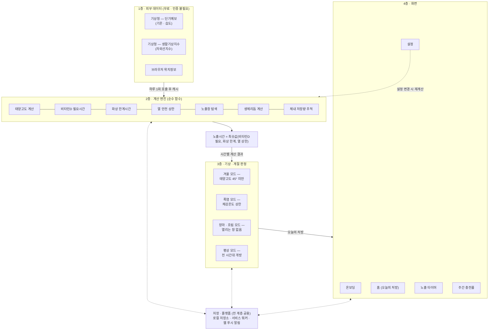

# 일광 처방 — 시스템 아키텍처

백엔드 없음 · 클라이언트 전용 · 딥러닝 미사용

```mermaid
flowchart TB
    subgraph L1["1층 · 외부 데이터 (무료 · 인증 불필요)"]
        direction LR
        A1["기상청 — 단기예보<br/>(기온 · 습도)"]
        A2["기상청 — 생활기상지수<br/>(자외선지수)"]
        A3["브라우저 위치정보"]
    end

    subgraph L2["2층 · 계산 엔진 (순수 함수)"]
        direction LR
        B1["태양고도 계산"]
        B2["비타민D 필요시간"]
        B3["화상 한계시간"]
        B4["열 안전 상한"]
        B5["노출창 탐색"]
        B6["생체리듬 계산"]
        B7["체내 저장량 추적"]
    end

    B8["노출시간 = 최솟값(비타민D 필요, 화상 한계, 열 상한)"]

    subgraph L3["3층 · 기상 · 계절 판정"]
        direction LR
        C1["겨울 모드 —<br/>태양고도 45° 미만"]
        C2["폭염 모드 —<br/>체감온도 상한"]
        C3["장마 · 흐림 모드 —<br/>열리는 창 없음"]
        C4["평상 모드 —<br/>전 시간대 개방"]
    end

    subgraph L4["4층 · 화면"]
        direction LR
        D1["온보딩"]
        D2["홈 (오늘의 처방)"]
        D3["노출 타이머"]
        D4["주간 충전률"]
        D5["설정"]
    end

    P["저장 · 플랫폼 (전 계층 공용)<br/>로컬 저장소 · 서비스 워커 · 웹 푸시 알림"]

    L1 -->|"하루 1회 호출 후 캐시"| L2
    B1 --- B2 --- B3 --- B4 --- B5 --- B6 --- B7
    L2 --> B8 -->|"시간별 계산 결과"| L3
    L3 -->|"오늘의 처방"| L4

    L2 <-.-> P
    L3 <-.-> P
    L4 <-.-> P
    D5 -.->|"설정 변경 시 재계산"| L2
```
